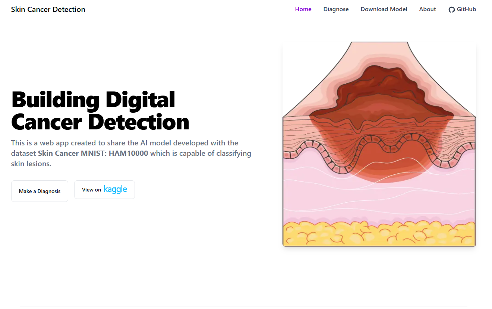
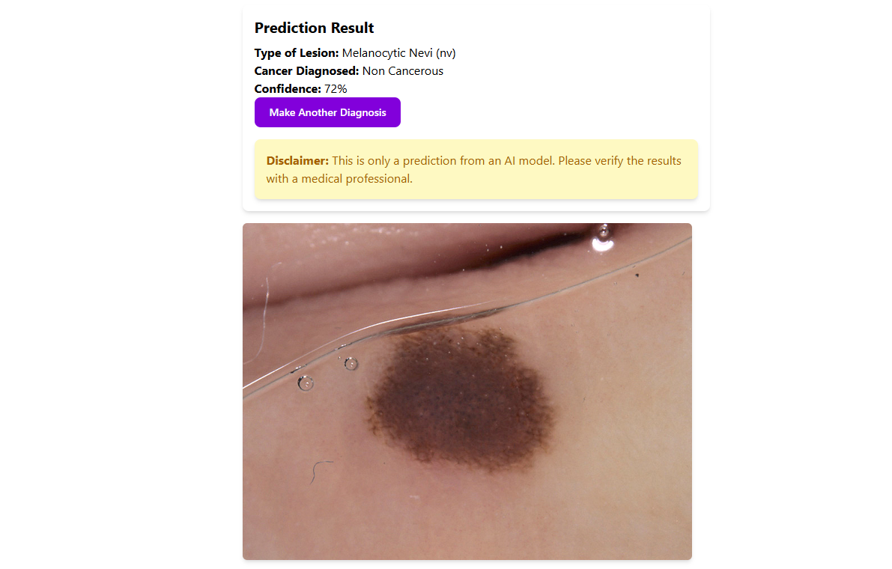
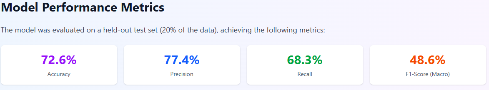
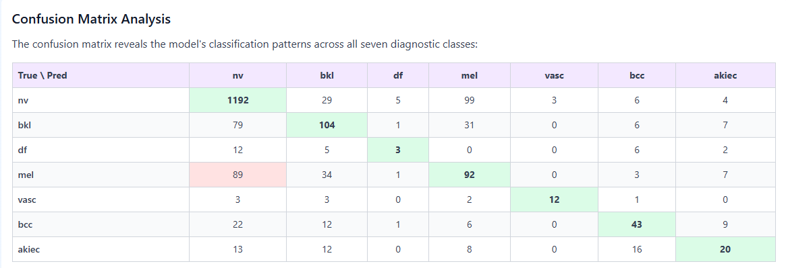
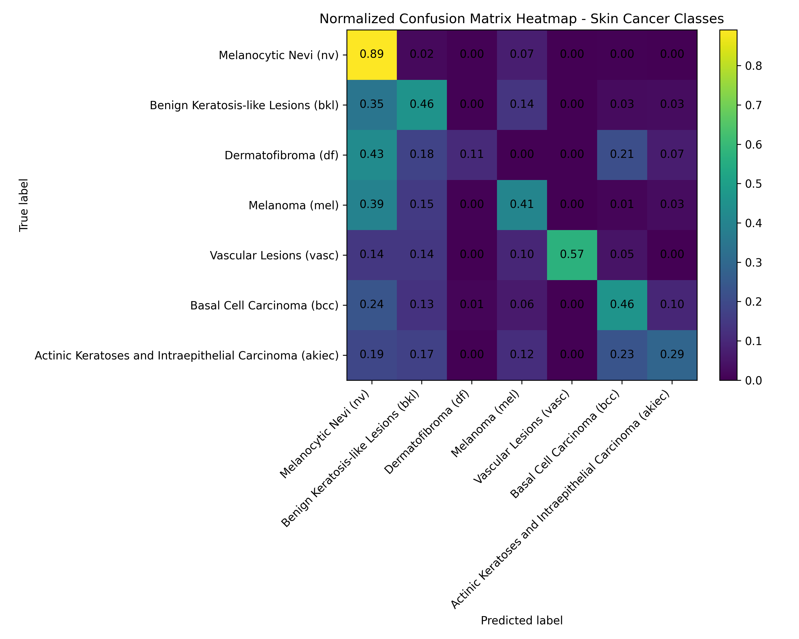

# 🔬 AI-Powered Skin Cancer Detection System

[](https://melanoma-project.vercel.app/)
[](https://www.python.org/)
[](https://www.tensorflow.org/)
[](https://nextjs.org/)
[](https://www.typescriptlang.org/)

> **A full-stack deep learning application that classifies skin lesions across seven diagnostic categories using computer vision and modern web technologies.**

**Live Application:** [melanoma-project.vercel.app](https://melanoma-project.vercel.app/)

---

## 📋 Executive Summary

This project demonstrates **end-to-end machine learning engineering capabilities**, from research and model development to production deployment. Built as a clinical decision support tool for dermatological screening, it showcases proficiency in:

- **Deep Learning Architecture Design** - Custom CNN with optimized layers for medical image classification
- **Data Engineering** - Preprocessing, augmentation, and handling class imbalance in medical datasets
- **Model Optimization** - ONNX conversion for efficient client-side inference
- **Full-Stack Development** - Modern React/Next.js frontend with TypeScript
- **Production Deployment** - Containerized application deployed on Vercel with CI/CD

### 🎯 Key Technical Achievements

- **Built a 7-class skin lesion classifier** trained on 10,000+ dermoscopic images (HAM10000 dataset)
- **Achieved 72.6% accuracy** with comprehensive evaluation across precision, recall, and F1-score metrics
- **Implemented data augmentation pipeline** increasing training samples by 63% (8,012 → 13,012 images)
- **Optimized for production** with ONNX Runtime for real-time client-side predictions (336ms inference time)
- **Deployed full-stack web application** with responsive UI and real-time image analysis

---

## 🖼️ Application Screenshots

### Landing Page

*Modern, responsive landing page with clear call-to-action and project overview*

### Detection Interface

*Real-time skin lesion classification with confidence scores and diagnostic results*

### Model Performance Dashboard

*Comprehensive visualization of model accuracy, precision, recall, and F1-scores*

### Confusion Matrix

*Detailed confusion matrix showing classification performance across all seven diagnostic classes*

---

## 🏗️ Architecture Overview

```
┌─────────────────────────────────────────────────────────────┐
│                    Frontend (Next.js 15)                    │
│  ┌──────────────┐  ┌──────────────┐  ┌──────────────┐       │
│  │   React 19   │  │  TypeScript  │  │ Tailwind CSS │       │
│  └──────────────┘  └──────────────┘  └──────────────┘       │
│                           ↓                                 │
│                  ONNX Runtime Web                           │
└─────────────────────────────────────────────────────────────┘
                            ↓
┌─────────────────────────────────────────────────────────────┐
│                  CNN Model (ONNX Format)                    │
│  ┌──────────────────────────────────────────────────────┐   │
│  │  Conv2D(32) → MaxPool → Conv2D(128) → MaxPool        │   │
│  │  → Dropout(0.5) → Dense(128) → Dense(32) → Dense(7)  │   │
│  └──────────────────────────────────────────────────────┘   │
└─────────────────────────────────────────────────────────────┘
                            ↑
┌─────────────────────────────────────────────────────────────┐
│              Training Pipeline (TensorFlow/Keras)           │
│  ┌──────────────┐  ┌──────────────┐  ┌──────────────┐       │
│  │   HAM10000   │→ │ Augmentation │→ │   Training   │       │
│  │   Dataset    │  │   Pipeline   │  │   & Export   │       │
│  └──────────────┘  └──────────────┘  └──────────────┘       │
└─────────────────────────────────────────────────────────────┘
```

---

## 💡 Technical Highlights

### Machine Learning & Deep Learning

- **Custom CNN Architecture**
  - 2 Convolutional layers (32 and 128 filters) with ReLU activation
  - MaxPooling (2×2) for spatial dimension reduction
  - Dropout (0.5) for regularization
  - 3 Dense layers culminating in 7-class softmax output
  
- **Data Preprocessing & Augmentation**
  - Image resizing and normalization (128×128 pixels, 0-1 range)
  - Random rotations (±40%) and horizontal/vertical flips
  - One-hot encoding for multi-class labels
  - Train-test split (80/20) with stratification

- **Model Performance**
  - **Accuracy:** 72.6% on held-out test set
  - **Precision:** 77.4% (weighted average)
  - **Recall:** 68.3% (weighted average)
  - **F1-Score:** 48.6% (macro-averaged across classes)
  - **Inference Time:** 336ms per prediction

### Frontend Development

- **Modern React Stack**
  - Next.js 15 with App Router
  - React 19 with TypeScript for type safety
  - Tailwind CSS for responsive, utility-first styling
  - Client-side model inference with ONNX Runtime Web

- **User Experience**
  - Drag-and-drop image upload interface
  - Real-time prediction with confidence scores
  - Responsive design for mobile and desktop
  - Dark mode support with Tailwind

### DevOps & Deployment

- **Containerization**
  - Multi-stage Docker build for optimized image size
  - Node.js 24 Alpine base for minimal footprint
  - Production-ready standalone Next.js build

- **CI/CD Pipeline**
  - Automated deployment to Vercel
  - GitHub integration for continuous delivery
  - Environment-based configuration

---

## 📊 Model Performance Analysis

### Classification Metrics

| Metric | Value | Description |
|--------|-------|-------------|
| **Accuracy** | 72.6% | Overall correct classification rate |
| **Precision** | 77.4% | Proportion of correct positive predictions |
| **Recall** | 68.3% | Proportion of actual positives identified |
| **F1-Score** | 48.6% | Harmonic mean of precision and recall |

### Confusion Matrix Insights


*Heatmap visualization of prediction accuracy across diagnostic classes*

**Key Findings:**
- ✅ **Strong performance on Melanocytic Nevi (nv):** 89.1% correctly classified (1,192/1,338)
- ⚠️ **Critical area for improvement:** Melanoma recall at 40.7% (92/226 cases)
- 📊 **Class imbalance challenges:** Minority classes (df, vasc, akiec) show reduced accuracy
- 🔍 **Clinical consideration:** 89 melanoma cases misclassified as benign nevi - highlights need for melanoma-focused optimization

---

## 🛠️ Technology Stack

### Machine Learning

| Technology | Purpose |
|------------|---------|
| **TensorFlow/Keras** | Neural network training and model building |
| **NumPy** | Numerical computing and array operations |
| **Pandas** | Data manipulation and analysis |
| **scikit-learn** | Train-test splitting and metrics evaluation |
| **OpenCV/PIL** | Image preprocessing and manipulation |
| **ONNX** | Model format conversion for deployment |

### Frontend

| Technology | Purpose |
|------------|---------|
| **Next.js 15** | React framework with server-side rendering |
| **React 19** | UI component library |
| **TypeScript** | Type-safe JavaScript development |
| **Tailwind CSS** | Utility-first CSS framework |
| **ONNX Runtime Web** | Client-side ML inference |

### DevOps

| Technology | Purpose |
|------------|---------|
| **Docker** | Containerization for consistent deployment |
| **Vercel** | Cloud platform for frontend hosting |
| **Git/GitHub** | Version control and collaboration |

---

## 🚀 Getting Started

### Prerequisites

- Node.js 18+ and npm
- Python 3.9+ (for model training)
- Docker (optional, for containerized deployment)

### Installation

1. **Clone the repository**
   ```bash
   git clone https://github.com/YOUR_USERNAME/melanoma_project.git
   cd melanoma_project
   ```

2. **Install frontend dependencies**
   ```bash
   cd frontend
   npm install
   ```

3. **Place the ONNX model**
   ```bash
   # Ensure model.onnx is in frontend/public/
   cp path/to/model.onnx frontend/public/
   ```

4. **Run the development server**
   ```bash
   npm run dev
   ```

5. **Visit the application**
   ```
   http://localhost:3000
   ```

### Docker Deployment

```bash
cd frontend
docker build -t melanoma-detection .
docker run -p 3000:3000 melanoma-detection
```

---

## 📁 Project Structure

```
melanoma_project/
├── frontend/                # Next.js application
│   ├── app/
│   │   ├── page.tsx        # Landing page
│   │   ├── detection/      # Image upload and prediction
│   │   ├── about/          # Project documentation
│   │   └── layout.tsx      # Root layout with header/footer
│   ├── public/
│   │   ├── model.onnx      # Trained model in ONNX format
│   │   └── onnx/           # ONNX Runtime WASM files
│   ├── Dockerfile          # Multi-stage production build
│   └── package.json
├── notebook/
│   └── MelanomaProyect.ipynb  # Jupyter notebook with model training
├── docs/
│   └── images/             # Screenshots and visualizations
└── README.md
```

---

## 🎓 Dataset

This project uses the **[Skin Cancer MNIST: HAM10000](https://www.kaggle.com/datasets/kmader/skin-cancer-mnist-ham10000)** dataset:

- **10,015 dermoscopic images** of pigmented skin lesions
- **7 diagnostic classes:**
  - Melanocytic Nevi (nv) - 6,705 images
  - Melanoma (mel) - 1,113 images
  - Benign Keratosis (bkl) - 1,099 images
  - Basal Cell Carcinoma (bcc) - 514 images
  - Actinic Keratoses (akiec) - 327 images
  - Vascular Lesions (vasc) - 142 images
  - Dermatofibroma (df) - 115 images

**Citation:** Tschandl, P., Rosendahl, C. & Kittler, H. The HAM10000 dataset, a large collection of multi-source dermatoscopic images of common pigmented skin lesions. Sci. Data 5, 180161 (2018).

---

## 🔮 Future Enhancements

- [ ] **Improve melanoma recall** through class weighting and focal loss
- [ ] **Add ensemble methods** combining multiple model architectures
- [ ] **Integrate user feedback loop** for continuous model improvement
- [ ] **Mobile application** using React Native and TFLite
- [ ] **Multi-language support** for international accessibility

---

## 📝 License & Ethics

This project is developed for **educational and research purposes only**. The AI model is designed as a clinical decision support tool and should **not be used for definitive medical diagnosis** without professional consultation.

**⚠️ Medical Disclaimer:** This application is not a substitute for professional medical advice, diagnosis, or treatment. Always seek the advice of qualified health providers with any questions regarding a medical condition.

---


## 🙏 Acknowledgments

- **Dataset:** HAM10000 by Tschandl et al. via [Kaggle](https://www.kaggle.com/datasets/kmader/skin-cancer-mnist-ham10000)
- **Inspiration:** Addressing the global need for accessible dermatological screening tools
- **Technologies:** TensorFlow, Next.js, ONNX Runtime, and the open-source community

---

## 📊 Project Statistics


**Made with 💜 from Chihuahua, Mexico**
